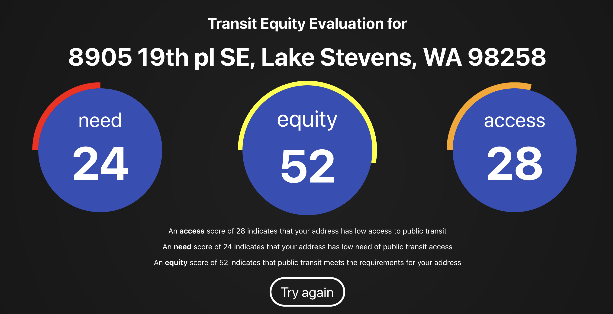
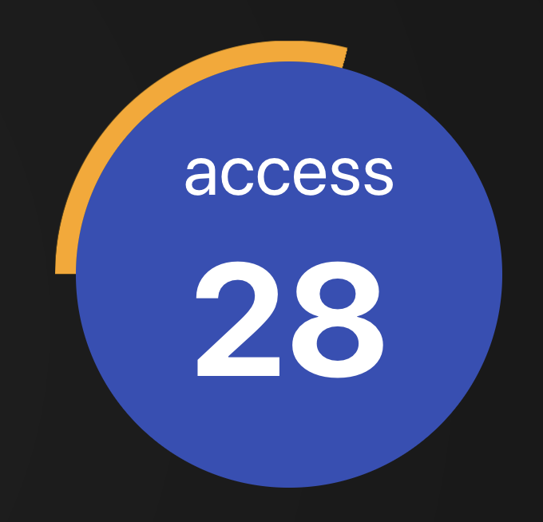
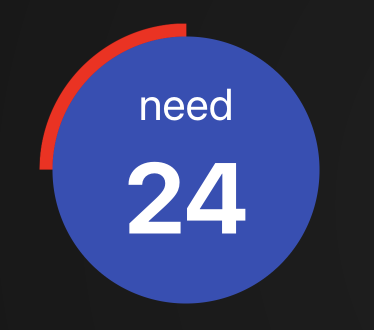
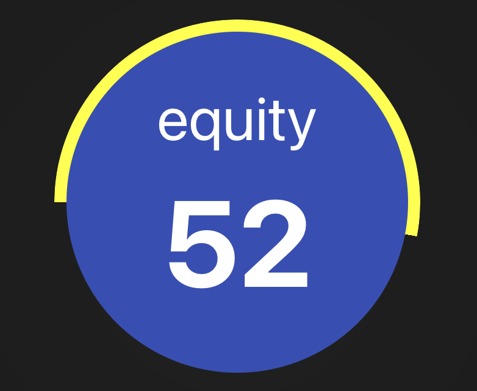

 

# Overview

The **Transit Equity Score Tool** calculates and assesses public transit accessibility in relation to community needs for a specified address entered by the user. It is designed to demonstrate a methodology we believe can be used to inform decisions on resource allocation by determining where public transit services are adequately provided, overprovided, or underprovided. The tool generates three key metrics:

 

- **Transit Access**: Measures how easily people in a given area can access public transit.
- **Transit Need**: Assesses the demand for public transit based on socio-economic factors.
- **Transit Equity**: Evaluates how well public transit services meet the community's needs, highlighting areas of potential improvement.

## Transit Access

 

Transit Access is based on the availability and convenience of public transit in an area. This score is influenced by:

- **Proximity to Bus Stops**: How close the bus stops are to residents.
- **Stop Frequency**: The number of buses that arrive at a stop within a given time period.
- **Route Diversity**: The number of different bus routes that pass through an area, offering more flexibility in travel.
- **Number of Bus Stops**: The total number of bus stops available within the area.

These factors are weighted to create a single access score. However, the raw numbers alone don't always capture meaningful differences—having a million stops may not be vastly better than 100 stops, but a jump from 5 to 25 is significant. To account for this, logarithmic normalization is applied to the access score, creating a curve where increases in access show diminishing returns at higher values. This approach ensures that areas with high transit coverage aren’t unfairly rated much better than areas with moderate, but still effective, coverage.

## Transit Need

 

Transit Need measures how necessary public transit is for an area's residents, based on:

- **Income vs. Cost of Living**: Lower-income households, especially those where the cost of living is high, are more reliant on public transit.
- **Cars Per Person**: Fewer cars per person indicates a higher reliance on public transit.
- **Household Size**: Larger households are more likely to have multiple people depending on the same transportation options.

The need score reflects how reliant the community is on public transit services. As with transit access, logarithmic normalization is used to capture meaningful differences—small changes in the need for transit (such as a small decrease in income or car ownership) have a larger impact at lower levels of access than at higher ones.

## Transit Equity

 

Transit Equity is the comparison between the Transit Access and Transit Need scores. It helps determine whether the available public transit services match the community's needs. This score is evaluated as follows:

- **Overprovision (Score > 60)**: If transit access is significantly higher than transit need, it indicates there may be room to reallocate resources to other underserved areas.
- **Balanced Provision (Score 40-60)**: If access and need are close to equal, it shows that transit services adequately meet the community's needs.
- **Underprovision (Score < 40)**: If need exceeds access, it highlights that the area is underserved and should be prioritized for public transit improvements.

---

# Data Sources

The Transit Equity Score Tool relies on a variety of data sources to ensure accuracy and comprehensiveness when calculating transit access, need, and equity. Below is an overview of where we obtain the critical information used in our assessments:

## Cost of Living

We obtain cost of living data from the **Bureau of Labor Statistics (BLS)**, which provides detailed information on regional price indexes by county. This data is essential for determining how household income compares to the local cost of living, a key factor in evaluating transit need.

## Population Salary and Demographics

Population salary data comes from the **U.S. Census Bureau**, which offers publicly available datasets on median household income, salary distributions, and other socio-economic indicators. These are used to assess the financial need for public transit services in different areas.

## People Per Household and Housing Density

Household size (people per household) and housing density (number of households per area) are also sourced from the **U.S. Census Bureau**. These metrics help us gauge the demand for public transit within specific communities, as larger households and denser areas typically require more robust transit services.

## Transit Data

For public transit information, we are currently working with **Community Transit**, which serves Snohomish County. They provide publicly available data on bus stop locations, route diversity, stop frequency, and other transit-related factors. This data forms the backbone of our Transit Access score. As we expand to cover more of the Northwest region, we plan to gather similar data from additional transit agencies.

By combining these various datasets, we can build a comprehensive picture of how well public transit services meet the needs of different communities, ensuring that our Transit Equity Score Tool delivers meaningful, actionable insights.

--

## Technologies Used

### Frontend: React
The frontend is built with [React](https://reactjs.org/), providing a dynamic and interactive interface for users to view transit equity scores. Key features include:
- **Responsive UI**: Ensures accessibility across devices.
- **Data Visualization**: Real-time display of transit scores on a map.
- **State Management**: Efficient use of React hooks like `useState` and `useEffect` to manage the flow of data and updates.

### Backend: Flask
The backend server is powered by [Flask](https://flask.palletsprojects.com/), a lightweight Python web framework. Flask handles:
- **Routing**: Serves the frontend React app and manages API routes for data processing.
- **CORS Configuration**: Ensures smooth communication between the frontend and backend.
- **Data Handling**: Receives requests from the frontend, processes them, and returns calculated scores.

### Data Processing: NumPy and Python
Data processing is performed in Python using [NumPy](https://numpy.org/), with a focus on transforming raw data into meaningful scores:
- **Logarithmic Data Transformation**: Applies a logarithmic scale to normalize the distribution of various inputs (e.g., car ownership, income) to ensure that extreme values do not skew the results.
- **Efficient Calculations**: NumPy is used to perform vectorized operations, which are much faster for large datasets than traditional Python loops.

### Database: PostgreSQL
The SQL server is hosted on [PostgreSQL](https://www.postgresql.org/), which stores the processed data retrieved from CSV files:
- **Data Ingestion**: Data is read from CSV files and inserted into the database for persistent storage.
- **Normalized Schema**: The database schema is designed to store data on transit stops, routes, demographics, and socioeconomic factors.
- **Querying**: Efficient queries are made to retrieve relevant data for transit need/access score calculations.

--

## Current Work and Future Plans

### Ongoing Efforts

Right now, we are focused on expanding the Transit Equity Score Tool to cover the entire Northwest region. To achieve this, we need access to more detailed transit data from local agencies. Unfortunately, not all transit agencies make their data publicly available, so we’re actively reaching out to these agencies to request access. This data is crucial to ensure that our tool accurately reflects the state of public transit across different communities.

In addition to transit data, we are working to identify more granular demographic datasets. Specifically, we are seeking detailed information on household size and car ownership for smaller geographic areas. Currently, much of this data is only available at the county level, which creates challenges when evaluating transit need. Since many transit agencies operate within their own counties, these large-scale datasets may not accurately represent local demand for public transportation. Finding finer-grained data will help us better align the need calculations with the regions served by these agencies.

### Future Deployments and Public Access

Our goal is to eventually make the Transit Equity Score Tool available as a public API. This would allow developers, policymakers, and researchers to integrate our transit equity data into their own applications, helping to drive more informed public transit decisions. For now, the app is publicly accessible, and anyone can explore transit equity scores in Snohomish County, WA.

We aim to position this tool as an open-source alternative to proprietary services like Walk Score. By making this tool accessible and customizable, we hope to provide a transparent and reliable measure of public transit adequacy across diverse regions.

### Customization and Machine Learning

We are currently developing a React-based calculator that will allow users to customize the weights for different transit access and need factors directly on the website. Users will be able to adjust factors like proximity to bus stops, route diversity, and household size to see how the Transit Equity Score changes with different weightings. This flexibility will give community leaders and transit agencies the ability to experiment with the methodology and understand how changes in transit service can impact equity scores.

In the future, we plan to refine these weightings using a machine learning model, specifically a random forest regression model. By training this model on example scores provided by transit professionals, we can better tailor the methodology to reflect expert judgment. The goal is to combine data-driven insights with professional knowledge to improve the accuracy and usefulness of the Transit Equity Score.

### Address Mapping

We are also planning to add a new mapping feature to the Transit Equity Score Tool. This feature will allow users to input a collection of addresses in the Northwest region and visualize transit access, need, and equity scores for each location on a map. By integrating this mapper, users will be able to see geographic trends and disparities in transit equity, which can help inform decisions at a more localized level.

---

## Next Steps

As we continue to expand and refine the tool, our next priorities include:

- Securing additional transit and demographic data from more agencies across the Northwest.
- Enhancing the granularity of our demographic data for smaller regions.
- Deploying the React calculator and gathering user feedback.
- Working with transit professionals to train a machine learning model that optimizes the weightings for our scoring methodology.

We believe that with these efforts, the Transit Equity Score Tool will become an essential resource for evaluating and improving public transportation systems across the Northwest and beyond.
